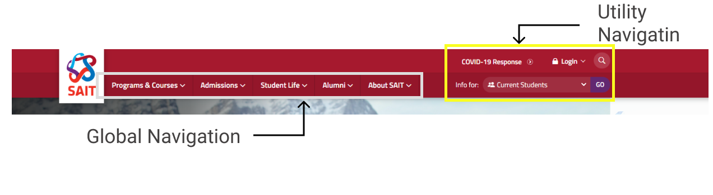
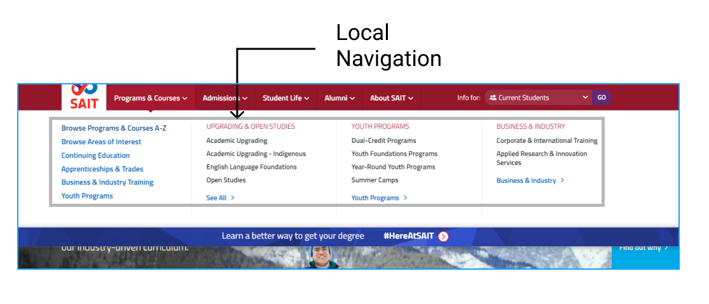
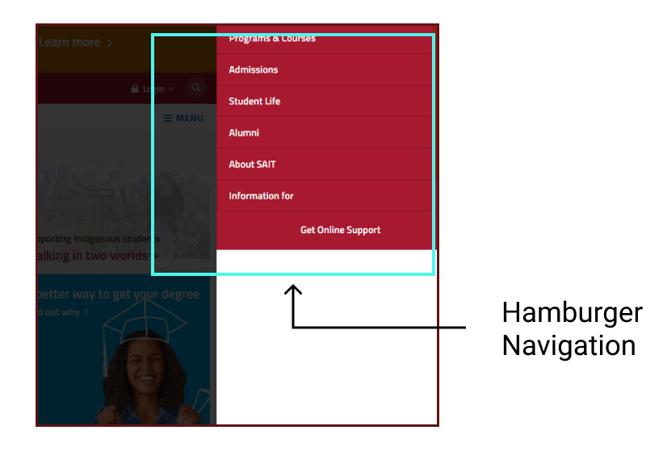
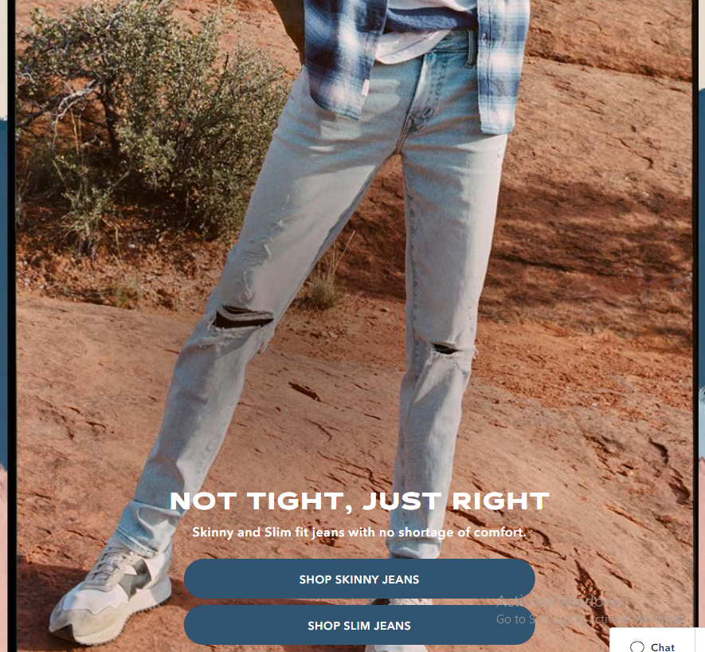

# dsgn270-a2
Will Tengyuan Li DSGN 270 Assignment 2 - Convention Treasure Hunt
## Part one
.
.
.
## Part two
.
.
- This American-Eagle web page is a very good example of visual hierachy.
- 1. The target audience that this website caters to is who wants to find something on sale.
  2. The benefit this website provides to its users:
    Very clear, We are on sale for this winter warm up!
- In my opion, this is an effective Call-to-Action. 
Once users open the web page, they can see the how much deduction they can get from here and what promote code they can use. 
What action the website want uses to perform is clicking on the shop Women/Men/Aerie button, and use their promote code which is WARMUP22. 
The visual hierachy in this page is good. 
First, the $$$ OFF signs are using the biggest letters that attract user's eyeball. 
Second, the dark blue SHOP button with white letters make a good contract. Users can not avoid to see that. 
Third, the huge specific categories display pictures with SHOP ... button makes users know what they can get from here and easy to go to the categories.
  